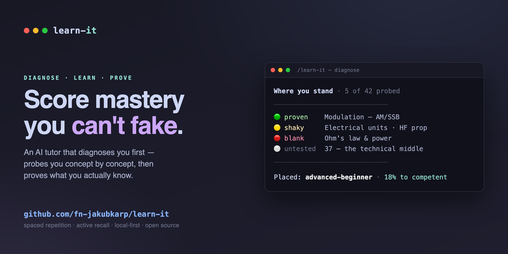

# Learn-it

<!-- README-I18N:START -->

[English](README.md) | [中文](README.zh.md) | [Español](README.es.md) | [Polski](README.pl.md) | [日本語](README.ja.md) | **Deutsch**

<!-- README-I18N:END -->

<p align="center">
  
</p>

<p align="center">
  <em>Die meisten Lern-Apps belohnen dich fürs Wiedererkennen der richtigen Antwort. Wiedererkennen ist nicht Erinnern.</em><br>
  <strong>Learn-it führt dich durch bewährte Methoden der Kognitionswissenschaft, bis Wissen sitzt — und bewertet Können danach, was du <em>beweist</em>, nie nach dem, was du behauptest.</strong><br>
  <em>Local-first. Open Source.</em>
</p>

<p align="center">
  <a href="https://claude.com/claude-code"></a>
</p>

---

<p align="center">
  
</p>

<p align="center"><strong>Verteiltes Wiederholen · Aktives Abrufen · Bloom-Tiefe · Dreyfus-Stufen · Ein Beherrschungswert, den du nicht faken kannst</strong></p>

<p align="center">
  <sub>Läuft mit jeder CLI nach dem agent-skill-Standard</sub><br>
  
  
  
  
  <br>
  <a href="https://github.com/fn-jakubkarp/learn-it/actions/workflows/ci.yml"></a>
  <a href="https://github.com/fn-jakubkarp/learn-it/releases/latest"></a>
  
  <a href="LICENSE"></a>
</p>

Du kannst eine Antwort wiedererkennen, wenn du sie siehst, und sie trotzdem nicht ohne Hinweise aus dem Gedächtnis hervorholen. Learn-it ist für die zweite Art des Wissens gemacht: Es erzeugt einen personalisierten Lernpfad und führt dich dann durch bewährte Methoden der Kognitionswissenschaft - verteilte Wiederholung (FSRS), aktives Abrufen, Feynman, Bloom-Tiefe und die Dreyfus-Kompetenzleiter - bis Wissen wirklich im Langzeitgedächtnis ankommt.

Gesteuert wird es von einer KI über die Fähigkeit `/learn-it`. Die KI diagnostiziert dich, lehrt und bewertet; eine schlanke Bun-CLI ist die Engine, die sie aufruft und die nur das protokolliert, was du tatsächlich nachweist.

> [!NOTE]
> Beherrschung wird **aus protokollierter Leistung berechnet, niemals selbst angegeben.** Den eigenen Wert zu manipulieren ist genau die Illusion von Kompetenz, die dieses Werkzeug besiegen soll - das Bearbeiten einer Datei kann ihn also nicht bewegen.

## Funktionen

- **Personalisierte Roadmap** - eine Diagnose erfasst, was du bereits kannst, und zerlegt ein Fach in konzeptgroße Blätter, sodass du Beherrschtes überspringst und nicht kognitiv überlastet wirst.
- **Verteilte Wiederholung auf Konzeptebene** - jedes *Konzept* (nicht jede Karte) trägt seinen eigenen FSRS-Zeitplan, der durch jede Art vorangetrieben wird, mit der du es festigst: erneut erklären, Quiz, erneut lesen oder eine Karte.
- **Aktives Abrufen über viele Wege** - Karten sind ein Weg, nicht das Ziel. Erneutes Erklären (Feynman), das Beantworten einer scharfen Quizfrage oder eine kleine echte Aufgabe zählen; passives Wiederlesen wird nur als Wiedererkennen gewertet, niemals als Nachweis.
- **Strenge, nicht fälschbare Beherrschung** - eine Dreyfus-Stufe pro Fach (`novice → … → expert`), aggregiert aus einem reinen Anhängeprotokoll bewerteter Abrufe und nach Rubrik bewerteter Prüfungen. Menge hebt niemals eine Stufe; `expert` erfordert einen echten Build plus Beständigkeit über die Zeit.
- **Ein Beobachter, keine Schienen** - die Phase wird aus dem realen Zustand *abgeleitet*, niemals gespeichert. Jede Stufe läuft auf Abruf; wenn du vorgreifst, gibt der Beobachter einen Hinweis und überlässt dir die Entscheidung.
- **Viele Fächer gleichzeitig** - betreibe Rust, Computernetzwerke und Kochen parallel; die Wiederholungsschlange verschränkt das Fällige über alle hinweg.
- **Lokales Web-Dashboard** - eine build-freie `Bun.serve`-Seite unter `localhost:4321` zum eigenständigen Wiederholen zwischen den Sitzungen.

## Voraussetzungen

- [Bun](https://bun.sh) ≥ 1.3 - führt die gesamte Engine aus (CLI, Dashboard, Tests, das gebündelte SQLite). Kein Node.js nötig.
- `git`.
- Eine agentische CLI zur Steuerung - empfohlen wird [Claude Code](https://claude.com/claude-code); die Fähigkeit ist auch für [Qwen Code](https://github.com/QwenLM/qwen-code), [OpenCode](https://opencode.ai) und die [Gemini CLI](https://github.com/google-gemini/gemini-cli) eingerichtet.

## Installation

Der Einzeiler installiert bei Bedarf Bun, klont das Repository, installiert die Abhängigkeiten und erstellt die Datenbank.

**Linux / macOS**

```bash
curl -fsSL https://raw.githubusercontent.com/fn-jakubkarp/learn-it/main/install.sh | bash
```

**Windows (PowerShell)**

```powershell
irm https://raw.githubusercontent.com/fn-jakubkarp/learn-it/main/install.ps1 | iex
```

<details>
<summary>Oder manuell installieren</summary>

```bash
git clone https://github.com/fn-jakubkarp/learn-it.git
cd learn-it
bun install
bun src/init-db.ts          # create data/learn_it.db
bun run verify              # optional: biome + tsc + bun test
```

</details>

<details>
<summary>Ohne Telemetrie installieren</summary>

Schreibe die Opt-out-Einstellung **vor dem ersten Start** — Bun lädt `.env` automatisch, sodass jeder Befehl von Anfang an deaktiviert ist (kein Erst-Start-Hinweis, es wird nie eine id erzeugt). `.env` ist in gitignore.

**Linux / macOS**

```bash
git clone https://github.com/fn-jakubkarp/learn-it.git && cd learn-it
echo "LEARN_IT_TELEMETRY=0" > .env
bun install && bun src/init-db.ts
```

**Windows (PowerShell)**

```powershell
git clone https://github.com/fn-jakubkarp/learn-it.git; cd learn-it
"LEARN_IT_TELEMETRY=0" | Out-File -Encoding ascii .env
bun install; bun src/init-db.ts
```

Lieber ein systemweiter Schalter? `export DO_NOT_TRACK=1` deaktiviert die Telemetrie hier und in jedem anderen Tool, das [den Standard](https://consoledonottrack.com) respektiert.

</details>

## Verwendung

Öffne deine agentische CLI **innerhalb des Repositorys** - die Engine läuft mit dem Repository-Stammverzeichnis als Arbeitsverzeichnis - und rufe die Fähigkeit auf. Ohne Argument zeigt sie das Dashboard über alle Fächer; ein Argument benennt eine Stufe. Learn-it ist dafür gemacht, von der KI gesteuert und nicht von Hand getippt zu werden - die Schleife ist dialogisch: diagnostizieren → sprechen → planen → verteilte Wiederbegegnung → verifizieren.

```
/learn-it                   # dashboard across all subjects + the command menu
/learn-it init rust         # start a subject (just your goal — no self-inventory)
/learn-it explore-gaps rust # the diagnostic: it tests you and places you, you don't self-report
/learn-it reinforce         # the daily loop: spaced, varied re-exposure of due concepts
```

### Stufen

Jede Stufe läuft auf Abruf - nichts ist blockiert. `[subject]` ist optional (wirkt bei Weglassen auf alle Fächer); `{…}` ist erforderlich.

**Diagnostizieren & planen**

| Stufe | Was sie tut |
| --- | --- |
| `/learn-it` | Startet das Dashboard und gibt dann Zustand und Befehlsmenü über alle Fächer aus. |
| `init {subject} [slug]` | Legt das Gerüst des Fachs an und erfasst dein **Ziel** (Warum + Zielwert). Vergibt einen kurzen, ascii **Slug** (z. B. `egzamin-krotkofalowca-klasa-1`) — die stabile, anführungssichere ID, die du an spätere Befehle übergibst (der volle Name funktioniert ebenfalls). Keine Selbstauskunft — die Einstufung wird gemessen, nicht erklärt. |
| `explore-topic {subject}` | Kartiert das **gesamte** Gebiet in Konzepte und registriert es — die Abdeckung stammt aus dem Fachgebiet, nicht aus deiner Erinnerung, sodass auch unbenannte Lücken auf der Karte landen. |
| `explore-gaps {subject}` | Sondiert ein Konzept nach dem anderen (reagiere auf einen Reiz, kein freies Erinnern), vermittelt an jeder Lücke einen einzeiligen Kerngedanken und schreibt einen 🟢/🟡/🔴-Bericht, wo du tatsächlich stehst. Setzt ein `target`. |
| `plan {subject}` | Gleicht die Karte mit den Sondierungsbefunden ab; ordnet sie fundamentzuerst. |

**Lernen & verankern**

| Stufe | Was sie tut |
| --- | --- |
| `concept {term}` | Lehrt per Analogie + Mechanismus; du formulierst es in `notes.md` neu. |
| `anchor {facts}` | Eselsbrücken nur für rohe Fakten (Syntax, Namen, Daten). |
| `extract {subject}` | Wandelt deine Notizen in Karten um. |

**Abrufen & verteilen**

| Stufe | Was sie tut |
| --- | --- |
| `reinforce [subject]` | **Die tägliche Schleife** - verteilte, abwechslungsreiche Wiederbegegnung mit fälligen Konzepten, die schwächsten zuerst. |
| `review [subject]` | Kartenabruf, bewertet, mit Rückmeldung bei Fehlern. |
| `quiz {subject} {concept}` | Eine scharfe Abruf-/Anwendungsfrage. |

**Verifizieren & bewerten**

| Stufe | Was sie tut |
| --- | --- |
| `feynman {subject}` | Du erklärst es zurück; die KI sondiert Lücken → protokolliert `explain`-Nachweis. |
| `exam {subject}` | Ein harter Test an einem *neuen* Problem → protokolliert `apply`-Nachweis. |
| `assess {subject} [kind]` | Gibt eine strukturierte Hausaufgabe (`explain`/`apply`/`build`) aus, die auf deine Schwachstelle zielt. |
| `evaluate {subject} {kind} {0-100} [file]` | Bewertet eine Einreichung nach fester Rubrik (≥ 70 besteht) und schließt die Aufgabe. |
| `mastery {subject}` | Aktuelle Stufe, % bis zur nächsten und was sie genau blockiert. |

> [!NOTE]
> `build` ist die Meilenstein-Art: ein kleines, aber echtes Artefakt, das vor der Bewertung hinterfragt wird. Ein bestandener `build` ist der einzige Weg zu dem Nachweis, den eine `expert`-Bewertung verlangt.

Zum eigenständigen Wiederholen zwischen den Sitzungen braucht das lokale Dashboard keine KI:

```bash
bun src/dashboard.ts        # → http://localhost:4321
```

> [!TIP]
> Damit `/learn-it` aus jedem Projekt auffindbar ist, installiere es als Claude-Code-Plugin: `/plugin marketplace add fn-jakubkarp/learn-it` und dann `/plugin install learn-it@learn-it`. Die Engine läuft weiterhin aus dem geklonten Repository, also behalte den Klon.

> [!IMPORTANT]
> Die nackten `bun src/learn-it.ts <cmd>`-Aufrufe sind die Engine, die die Fähigkeit steuert, kein manueller Arbeitsablauf. Greife nur dann direkt darauf zu, wenn du deine Daten inspizieren oder skripten willst (`export`, `doctor`, `db`).

## Funktionsweise

**Zwei Ebenen.** Ein *Fach (subject)* ist das, was du beherrschst (z. B. „Rust“), und trägt die Roadmap, die Phase und die Dreyfus-Stufe. Ein *Konzept (concept)* ist ein lektionsgroßes Blatt darunter (z. B. „ownership“); Karten hängen sich hier an. Die Roadmap ist die Konzeptliste, und die Beherrschung aggregiert sich aus ihr - in einem einzelnen Fakt kannst du kein „Experte“ sein.

**Phasen sind eine Landkarte, keine Eisenbahnschiene.** Learn-it liest deinen realen Zustand (Konzepte kartiert? *sondiert*? Karten wiederholt?), um abzuleiten, wo jedes Fach steht — diagnose wird zurückgelassen, wenn du geprüft wurdest, nie wenn du ein Formular ausgefüllt hast. Nichts ist blockiert.

```
diagnose → conceptualize → recall → space → verify → mastered
```

**Beherrschung wird verdient und ist mediumunabhängig.** Eine Stufe aufzusteigen erfordert nachgewiesene Behaltensleistung (ein Konzept nach einem realen Abstand abzurufen, nicht am selben Tag) plus Nachweise, die keine Karten sind - es zu erklären, auf neue Probleme anzuwenden und, für `expert`, etwas Echtes zu bauen. Die Verteilung zählt die real verstrichene Zeit, also bewegt Pauken am selben Tag nichts.

**Prüfungen sind schablonenbasiert, nicht improvisiert.** `assess` gibt eine Aufgabe aus einer festen Vorlage aus; du reichst ein; `evaluate` bewertet sie nach einer festen Rubrik, damit die Bewertung nicht abdriftet. Ein bestandener `build` ist der einzige Weg zu dem Nachweis, den `expert` verlangt.

### Eigentumsmodell

| Belang | Eigentümer | Dateien |
| --- | --- | --- |
| **Wissen** | du verfasst es, die Engine liest nur | `subjects/<s>/{audit,notes,roadmap}.md`, `assessments/*.md` |
| **Zustand** | gehört der Engine, nicht von Hand bearbeiten | `data/learn_it.db` (Karten, Abrufprotokoll, Nachweise) |
| **Engine** | versionierte Logik + Prompts | `src/*.ts`, `stages/*.md`, `templates/*` |

Die eine Regel: Die Engine schreibt den *Zustand*, liest das *Wissen* und bearbeitet niemals eine von dir verfasste Datei.

### Die Engine

| Datei | Rolle |
| --- | --- |
| `src/learn-it.ts` | Sitzungs-Router: Dashboard, Beobachter, Konzepte, Karten, assess/evaluate, Beherrschung, Notizen, `export`, `doctor`. |
| `src/lifecycle.ts` | Leitet die Phase eines Fachs ab und berät (blockiert nie). |
| `src/scheduler.ts` | FSRS-Kern für Karten; protokolliert jeden Abruf gegen die real verstrichene Zeit. |
| `src/exposure.ts` | Verteilte Begegnung auf Konzeptebene (die `reinforce`-Schlange), vorangetrieben durch jeden Weg. |
| `src/mastery.ts` | Dreyfus-Stufen, aggregiert über Konzepte + Nachweise (Menge zählt nicht). |
| `src/init-db.ts` | Erstellt / migriert das SQLite-Schema. |
| `src/dashboard.ts` | Build-freies lokales Web-Dashboard. |
| `src/telemetry.ts` | Anonyme, inhaltsfreie Nutzungstelemetrie (Opt-out). |

Das vollständige Design — samt einem Diagramm des gesamten Ablaufs — findest du in [`docs/ARCHITECTURE.md`](docs/ARCHITECTURE.md).

## Telemetrie

Learn-it sendet **anonyme, inhaltsfreie** Nutzungstelemetrie (PostHog), damit das Tool anhand der tatsächlich genutzten Befehle verbessert werden kann. Beim ersten Senden wird ein deutlicher einmaliger Hinweis ausgegeben.

- **Was gesendet wird:** der ausgeführte Befehl (`grade`, `assess`, …), die App-Version, dein Betriebssystem und eine zufällige Id pro Installation. Das Dashboard wird nicht erfasst.
- **Was nie gesendet wird:** Fachnamen, Konzeptnamen, Kartentext, Notizen, Bewertungen — *alles*, was du lernst. Das bleibt in `data/*.db` auf deinem Rechner und verlässt ihn nie.
- **Jederzeit abschaltbar:** `export DO_NOT_TRACK=1` (der [werkzeugübergreifende Standard](https://consoledonottrack.com)) oder `export LEARN_IT_TELEMETRY=0`. CI-Läufe werden automatisch ausgeschlossen. Die anonyme Id liegt in `data/.telemetry-id` — löschen setzt sie zurück.

## Danksagungen

Der Skill-Router und das Prompt-Gerüst je Stufe sind von [career-ops](https://github.com/santifer/career-ops) (MIT) inspiriert. Methodik, Scheduling-Engine und Domänenlogik von Learn-it sind eigenständig.
