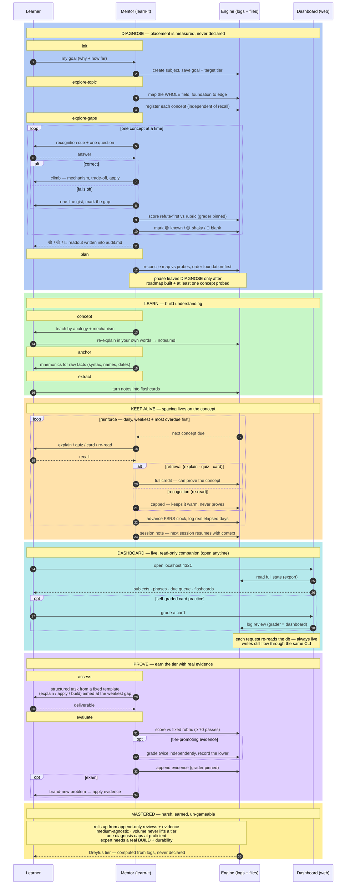

# Architecture

learn-it is an AI learning pipeline built on cognitive science: spaced repetition (FSRS), active recall, the Feynman technique, Bloom's depth levels, and the Dreyfus skill-acquisition ladder. The agent is a **mentor with tools**, not a course on rails.

## System at a glance

The whole flow, phase by phase — diagnose what you really know, learn it, keep it alive with spaced recall, then prove it. The watcher reads what actually happened; the dashboard is a live read-only view. State (tier, phase) is computed from logs, never declared.



## 2-tier structure: subjects → concepts

"Topic" is two different sizes of thing, so they're split:

- **Subject** — the thing you *master*: "Rust", "Computer Networking". Carries the roadmap, the inferred phase, and the Dreyfus **mastery tier**.
- **Concept** — a lesson-sized leaf under a subject: "ownership", "IP address types". Cards attach here. A concept is *proven-or-not*; it has no tier.

The **roadmap is the concept list**. Coverage and mastery roll up from concepts, so you can't be "expert in a single fact" — that's just a concept under some subject.

## The engine (`src/`)

| File | Role |
|------|------|
| `init-db.ts` | SQLite schema: `subjects`, `concepts` (each with its own exposure clock), `flashcards`, append-only `reviews`, `evidence`, `exposures`, `sessions`. Enforces foreign keys + WAL; idempotent column migrations. |
| `scheduler.ts` | FSRS spaced repetition; every grade logs a `reviews` row with the **real elapsed days** the card survived (`today − last_reviewed`), so retention can't be faked by same-day grading. `replayCard` powers `ungrade`. |
| `exposure.ts` | Concept-level spaced exposure: a concept's FSRS clock advanced by ANY surface (re-explain, quiz, re-read, card). `read` is recognition (capped, never proves); the rest are retrieval. The reinforcement queue (`dueConcepts`) and `recordExposure` live here. |
| `mastery.ts` | Dreyfus tiers computed from logged performance (no volume credit). |
| `lifecycle.ts` | Phase **map** (diagnose→…→mastered); infers phase from real state, advises but never blocks. |
| `learn-it.ts` | CLI router: dashboard, concepts, cards, probe, assess/evaluate, mastery, target. |

State (phase, tier) is **never stored** — it's computed from Knowledge (`subjects/<s>/*.md`, learner-authored) + the logged tables. The engine writes State, reads Knowledge, never edits a file you authored.

## Cards are one surface — spacing lives on the concept

The core loop is **diagnose the gaps → talk through them → agree a fix plan → keep concepts alive by spaced, varied re-exposure**, with substantive assessments for tier-moving evidence. Flashcards are an addon (with a read engine), not the spine.

So spacing is a property of the **concept**, not the card. Each concept carries its own FSRS clock (`concepts.stability/difficulty/interval/next_exposure`, `src/exposure.ts`) advanced by whichever surface the learner uses:

| Surface | Kind | Credit |
|---------|------|--------|
| `explain` (Feynman, micro) | retrieval | full — counts toward "proven" |
| `quiz` (one sharp question) | retrieval | full — counts toward "proven" |
| `card` (a flashcard review) | retrieval | full — counts toward "proven" |
| `read` (re-read your note) | recognition | capped (≤ "Hard"); keeps the concept warm, never proves it |

`due-concepts` (a.k.a. `reinforce`) is the primary "what should I do now" queue — weakest (blank → shaky → known) and most overdue first. A probe both *places* a concept (status) and seeds its clock; a card review records a `card` exposure so cards and talk feed the same schedule. Mastery's "proven"/durability roll-up counts retrieval across real gaps from **all** surfaces — finally symmetric, instead of flashcards-only. `read` is deliberately excluded from proof because re-reading is recognition, not recall.

**Assessments are separate and substantive** — real, actionable deliverables ("build a class with one method that does X", "solve this new problem") graded against a rubric. They are not exposure surfaces and must not be watered down into "read a paragraph" tasks.

## The learning map (not a railroad)

```
diagnose → conceptualize → recall → space → verify → mastered
```

- **Any stage on demand.** Nothing is blocked; the watcher nudges when you jump ahead.
- **Inferred phase.** Roadmap mapped? concepts *probed*? cards? reviews? applied evidence? → the phase follows. Diagnose is left behind by **demonstration** (a real probe), never by a hand-typed audit.
- **Many subjects at once**, each at its own phase. The review queue interleaves due cards across all of them.

Stages live as prompts in `stages/*.md`; the skill router is `skills/learn-it/SKILL.md` (symlinked into `.claude/skills/learn-it/` for project-skill discovery, and packaged as a plugin via `.claude-plugin/plugin.json`).

## Diagnose before you teach

A learner can't list what they don't know, and an experienced one shouldn't start at novice — so the tool never asks them to. `init` captures only the **goal** (why + target tier); it does not collect a self-inventory. Then:

1. **explore-topic** — map the *full* territory into concepts (`addconcept`), foundation to edge, independent of what the learner can recall — so gaps they could never have named are still on the map.
2. **explore-gaps** — *test* the learner across the map (`probe`), one concept at a time, react-to-cue not free-recall, teaching a one-line gist at each fall-off. This separates the three things that matter — what they can do (🟢), what they think they know but can't (🟡), what they never knew existed (🔴) — and writes that readout into `audit.md`. Placement is **earned** (logged evidence), never declared; a single session reaches at most **proficient**.

Set a `target` tier so the watcher focuses on the gap between where the learner is and where they want to be.

## Mastery (harsh, earned, un-gameable)

Dreyfus ladder: `novice → advanced-beginner → competent → proficient → expert`.

- Computed from the append-only `reviews` + `evidence` logs — never self-reported, so it can't be faked.
- **Medium-agnostic.** A concept is *proven* by retention (cards recalled after long gaps) **or** by passing higher-Bloom evidence (explain / apply / build). Flashcards are one stream, not the score.
- **Volume never lifts a tier.** Climbing needs proven concepts + demonstrated evidence.
- **Expert** additionally requires a passing **build** and **durability** — long-term retention OR passing apply/build evidence spread over real time (≥3 days, ≥30-day span).
- **Rewards are informational, not currency** — name genuine milestones (a concept surviving 30 days, a tier earned); no points/badges/streaks.

## Assessment loop (structured, not improvised)

```
assess (issue from template) → learner submits → evaluate (score vs rubric) → evidence → mastery
```

- `templates/assessment/{explain,apply,build}.md` — fixed task structure; the AI fills only the question.
- `templates/rubric/{explain,apply,build}.md` — fixed scoring dimensions + scale; the AI can't invent its own.
- `subjects/<subject>/assessments/<date>-<kind>.md` — the issued task, the submission, and the result.

A `build` is the milestone tier — a small but real artifact, interrogated before scoring; the only path to the evidence an expert rating requires.

## Two streams + session continuity

Flashcards are **one** stream, never the whole tool — mastery is medium-agnostic, and the highest-Bloom evidence comes from *talking*: explaining, applying, building. So the engine carries a **conversational stream** alongside cards:

- **`note` / `sessions`** — at the end of a working session the mentor writes a short note to the `sessions` table (what was covered, where the learner struggled, what to revisit). `resume` surfaces the latest per subject, so the next session — which may be pure dialogue, not a card review — picks up with context instead of cold-starting. These are engine State (LLM-authored, computed from what happened), distinct from the learner-authored `subjects/<s>/notes.md`.

## Dashboard wiring

`export` emits the full learner state as JSON (subjects, tiers, phases, concepts, cards + FSRS state, evidence, sessions, due counts) on stdout. It is the read surface an external dashboard consumes — the engine still owns the database; the dashboard only reads. `doctor` is the matching health check (schema, pragmas, grader provenance, orphans).

`src/dashboard.ts` is a dependency-free, build-free dashboard: `bun src/dashboard.ts` runs a `Bun.serve` HTTP server (default `:4321`) that serves one static page (`src/dashboard.html`) and a tiny JSON API which **shells out to the same CLI** — `export` for live state, `grade`/`note` for writes. So it adds no new source of truth and stays consistent with every CLI command; each request re-reads the database, so the watcher is always live. Card grades from the dashboard are self-graded recall practice, logged with `grader = "dashboard"` so they're distinguishable from AI-graded assessments in a provenance audit — tier-moving evidence still comes through the AI-graded assessment loop.

## Honest limits

A chat CLI can't observe study that happens outside the conversation, and can't fully prevent a looked-up answer or a borrowed artifact. The agent acts as a witness/examiner — it credits only what's demonstrated to it, and probing ("why X? what breaks if Y?") makes evidence hard to fake — but this is mitigation, not proof.
